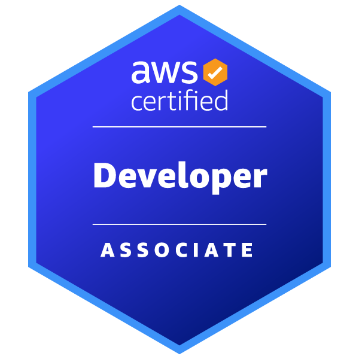

  

  

> logo designed by [SAWARATSUKI](https://github.com/SAWARATSUKI/KawaiiLogos)

## My Learning Skills (Updated regularly)

  
  
  
  
  
  
  
  
  
  
  
  
  
  

> logo designed by [SAWARATSUKI](https://github.com/SAWARATSUKI/KawaiiLogos)

## AWS Certification

  
  
  

## My Status

<!--START_SECTION:lapras-card-->

  
Last Updated on 2/19/2026, 12:16:55 AM

<!--END_SECTION:lapras-card-->

 
 

<!-- バッジ -->

  
  

